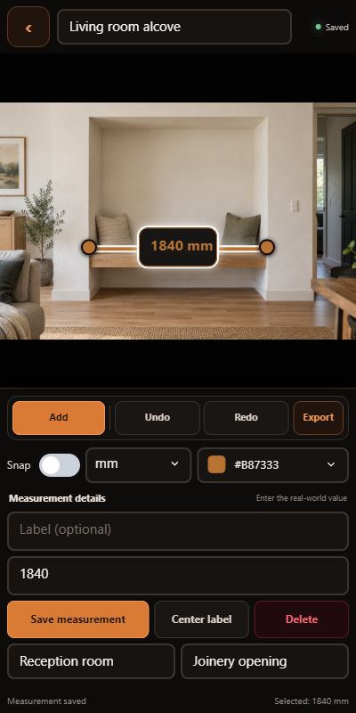

# AnnoTape

<p align="center"></p>

AnnoTape is an offline Android measurement notebook with a Windows desktop host for development and layout testing. Capture or choose a photo, draw optionally angle-snapped dimension lines over it, choose annotation colours and image-wide units, position attached or free labels, enter the real measurements, and share or save an annotated image.

The entered value is authoritative. AnnoTape does not infer physical dimensions from ordinary photo pixels and never labels pixel-derived values as measurements.



## Current state

The architecture spike and testable MVP are implemented. The portable editor, SQLite persistence, recovery state, camera/photo-picker boundary, and full-resolution PNG/JPEG export compile. Automated tests pass. Camera interoperability, process-death return, gestures, memory limits, and TalkBack still require representative Android hardware before a release claim.

The 0.2 alpha uses one photo per project. The schema already supports ordered multi-photo projects, so adding a document navigator does not require a migration.

## Stack

- C# and .NET 10
- Plain .NET for Android (no MAUI, WebView, JavaScript, or browser shell)
- [CupriFace](https://github.com/Wixely/CupriFace) engine, shell, and Android host `0.24.1-annotape.5` from pinned source
- SQLite with Dapper and DnaX `10.0.0-alpha.2` checksummed migrations
- SkiaSharp source-resolution export
- Minimum Android API 24; Android 13+ uses the system photo picker and earlier releases use `ACTION_OPEN_DOCUMENT`

CupriFace currently requires Android CoreCLR (`UseMonoRuntime=false`). The .NET Android SDK describes CoreCLR as experimental, so this is an explicit pre-release constraint rather than a production-support claim.

ReadyToRun is disabled for the APK because the Windows Android toolchain attempted to rewrite a mapped generated resource assembly (`NETSDK1096`). Release builds use conservative partial trimming: framework and SDK assemblies that explicitly support trimming are reduced, while AnnoTape and CupriFace's reflection-based bindings are not fully trimmed. The resulting CoreCLR/JIT package builds reliably; startup and package-size measurements remain part of device acceptance.

## Build and test

Prerequisites are .NET SDK `10.0.300`, the .NET Android workload, and a clean DnaX checkout beside this repository at its pinned commit:

```text
git/
  AnnoTape/
  DnaX/        # commit ab1471dd0caa3775f3bd26f9f12bf04d7df8752e
  CupriFace/   # commit 0cc37412c59994f2f4d029a73222886e71ef7210
```

Then run:

```powershell
.\eng\Prepare-DnaXPackages.ps1
.\eng\Prepare-CupriFacePackages.ps1
dotnet test tests\AnnoTape.Core.Tests\AnnoTape.Core.Tests.csproj -c Debug
dotnet test tests\AnnoTape.App.Tests\AnnoTape.App.Tests.csproj -c Debug
dotnet build src\AnnoTape.Desktop\AnnoTape.Desktop.csproj -c Debug
dotnet build src\AnnoTape.Android\AnnoTape.Android.csproj -c Debug
```

The preparation scripts populate the ignored repository-local `.packages` feed. DnaX and all three
CupriFace packages are built from pinned checkouts. Pass `-DnaXRoot` or `-CupriFaceRoot` when either
checkout is elsewhere.

GitHub Actions runs the Release tests, builds the Windows desktop layout host, and publishes a
downloadable ARM64 test-signed APK plus its SHA-256 checksum on every push and pull request. The
workflow can also be started manually. The artifact is suitable for testing, not store release.

For desktop layout testing, select **Run AnnoTape Desktop (layout testing)** in VS Code's Run and Debug view and press F5. The desktop Camera and Photo picker actions both open a local image picker. Exports can open in the registered Windows image application or be saved through the native file dialog. Scroll over the photo to zoom around the cursor, and hold the middle mouse button while moving to grab and pan it.

Build an installable release APK with:

```powershell
dotnet publish src\AnnoTape.Android\AnnoTape.Android.csproj -c Release -r android-arm64
```

The APK is written below `src\AnnoTape.Android\bin\Release\net10.0-android\android-arm64\publish\`. Debug deployment and attach tasks are included in `.vscode`.

## Privacy and storage

Projects, untouched source media, annotations, notes, and user-entered locations stay in app-private storage. The application requests no location, network, microphone, or broad-storage permission. Export is the only intentional disclosure path. See [docs/PRIVACY.md](docs/PRIVACY.md) and [docs/TESTING.md](docs/TESTING.md).

## Repository map

- `src/AnnoTape.Core`: geometry, units, commands, migrations, storage, and export
- `src/AnnoTape.App`: portable CupriFace UI and editor workflow
- `src/AnnoTape.Desktop`: Windows CupriFace host for interactive layout testing
- `src/AnnoTape.Android`: camera, picker, Android lifecycle, content URI, and sharing boundary
- `tests`: core and portable render tests
- `docs`: architecture, testing, signing, and privacy guidance

## License

AnnoTape is licensed under the [MIT License](LICENSE). Dependency notices are in [THIRD-PARTY-NOTICES.md](THIRD-PARTY-NOTICES.md).
